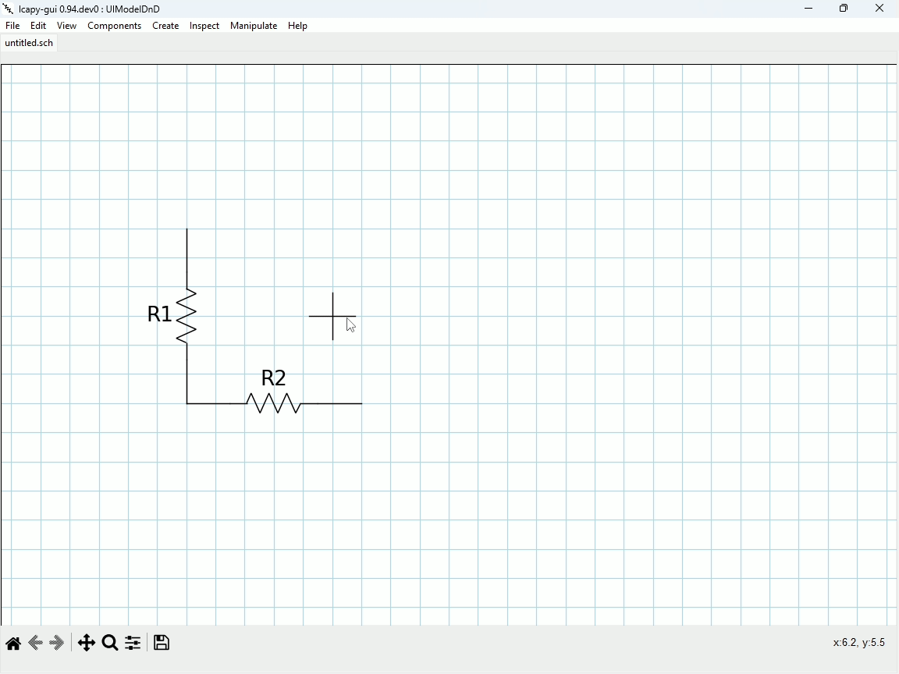
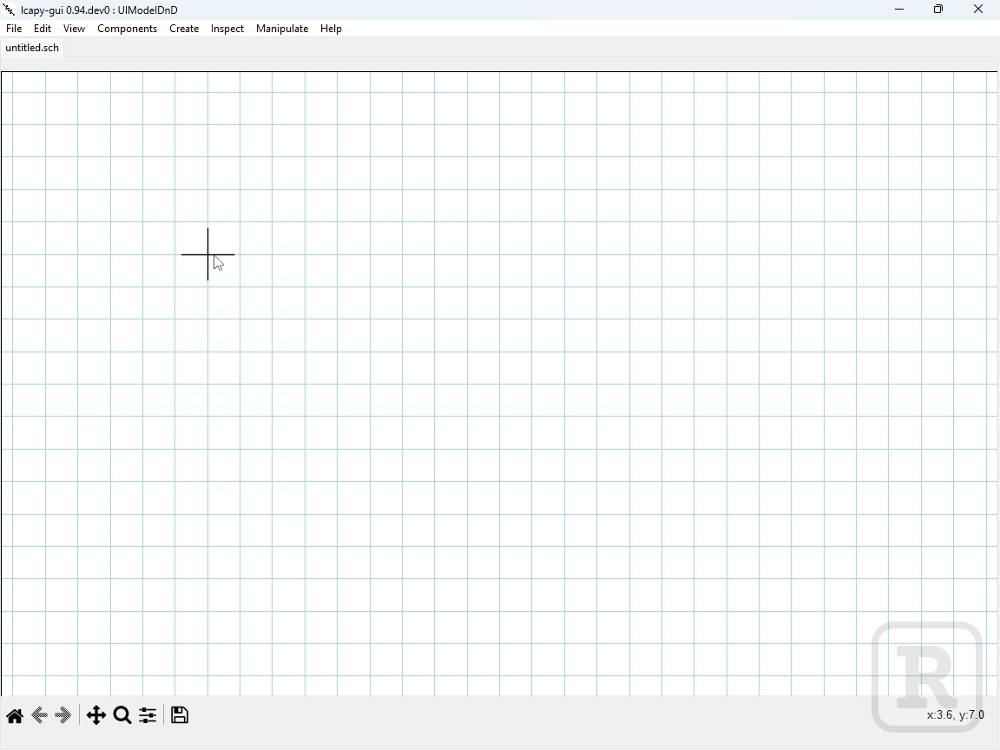
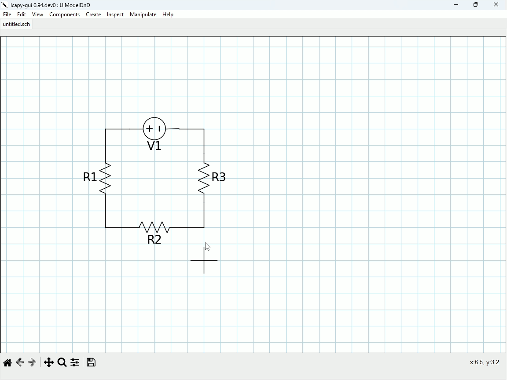
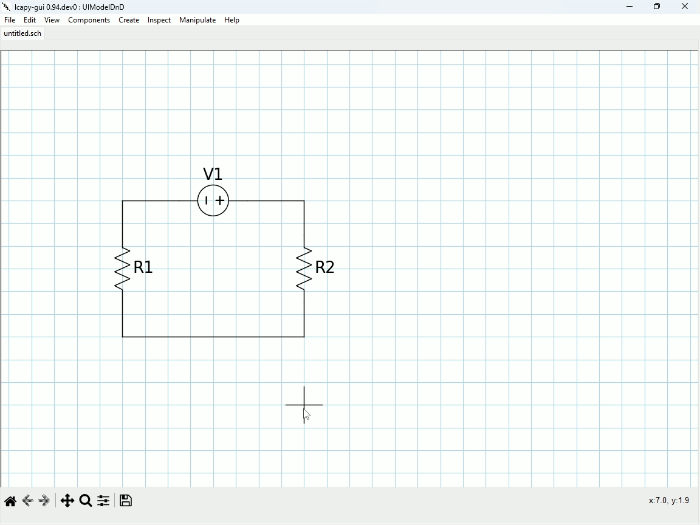

===============
Getting Started
===============

Working with components
=======================
Components can be added to the schematic in two ways.

Adding a component using the menu
---------------------------------

To add a component using the menu, select the component you want to add from the menu, the selected component type
should appear on the cursor.
You can click the circuit to place a fixed size component, or, click and drag to place the component between any two
desired points. This is the easiest way to ensure components are placed where you want them.

Adding a component using keybindings
------------------------------------

Much like above, you can select a component and place it the same way, however instead of using the menu it can often
be faster to use keybindings. The keybindings for placing various components are listed in :doc:`keybindings`, and
listed next to each component in the menu itself.

..  note:: Not every component has a keybinding, and keybindings cannot be changed in the UI.

Moving Components
-----------------

Sometimes components don't end up where you want or need them! No worries, you can drag a component around simply by
selecting it, then dragging it into place with your mouse.

Even better, you can select and drag the component by its end nodes.

Circuit Analysis
================

To analyse a circuit, first, select the component from which you want to analyse the circuit. Then, either right click on
it and choose one of the 'inspect' options as shown above!

..  note:: Displaying the circuit analysis equations *requires* :math:`\LaTeX` to be installed on your system. See
        :doc:`install` for information on how to do this. If you don't wish to install :math:`\LaTeX`, you can
        still analyse the circuit, but the equations will not be displayed automatically. To view it, dismiss any
        error messages that appear, then select [edit]->[expression] from the popup menu to view it in plaintext.
